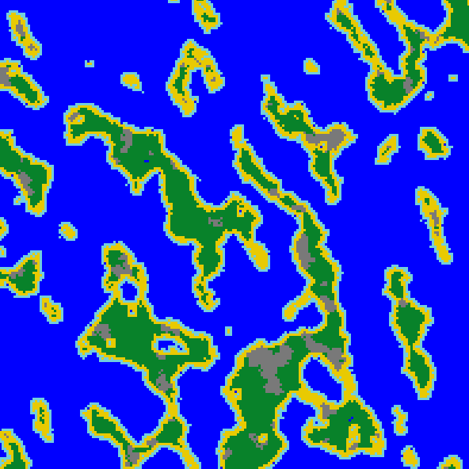
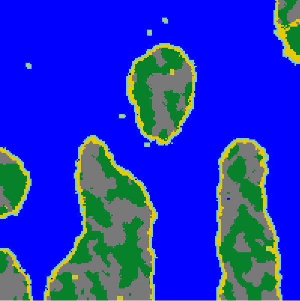
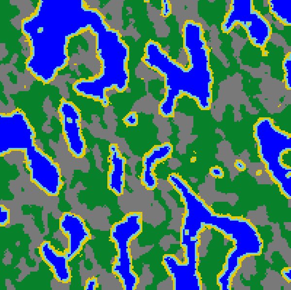
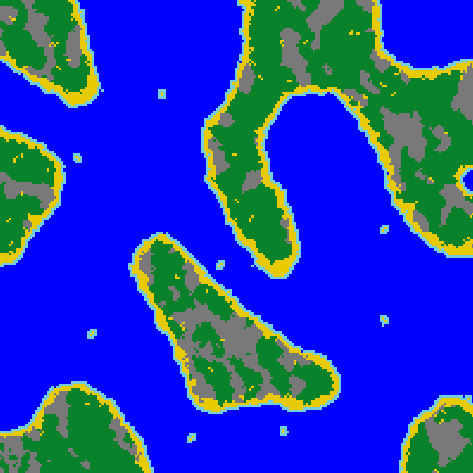

# 2D-Map-Generator
2D Map Generator is a Java program that can be used to 
generate procedural physical maps. While the generation process is randomized 
to a degree, it also depends on raw parameters that can be set at [Map.java](src/Map.java).

The generation algorithm is based on the idea of "self aware" pixels that can 
decide on their background color based on their neighborhood (surrounding pixels). 
Where this decision process is also influenced by mentioned raw parameters

The GUI provides already set parameter packages that would allow the user to 
generate maps of certain type (islands, lakes, peninsula) and resolution. The program 
also provides the option of saving the generated map to the local system.

  
  
  
  

## Prerequisites
[Java version 15.0.1](https://www.oracle.com/java/technologies/javase/jdk15-archive-downloads.html) 
was used for development

## Installation
The project utilizes in-built Java package [Swing](https://en.wikipedia.org/wiki/Swing_(Java)) for 
the GUI, hence no additional installations are required

## Getting Started
The program can run by downloading, unzipping [Map Generator.zip](Map%20Generator.zip) and running the **Map Generator.jar**

## Details
- Author - Arastun Mammadli
- License - [MIT](LICENSE)
